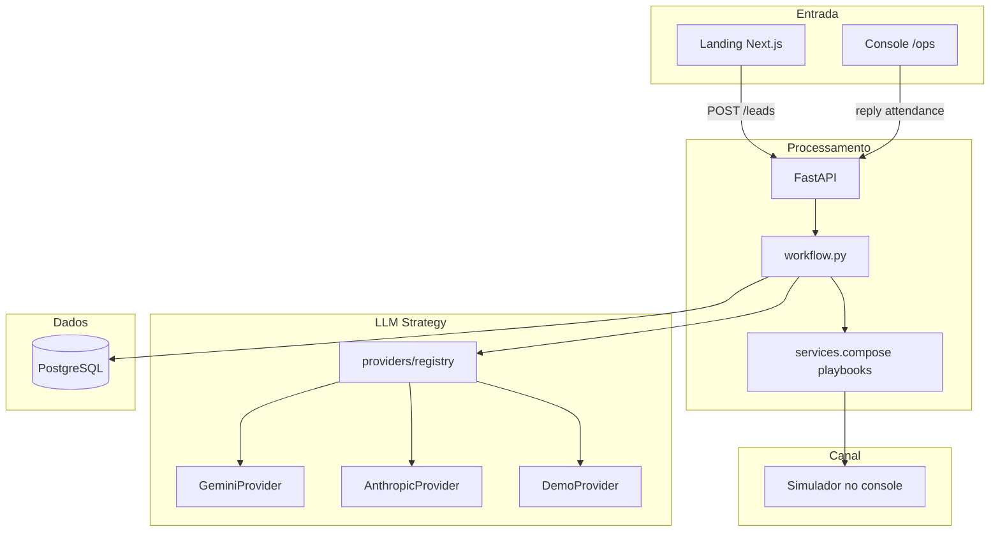
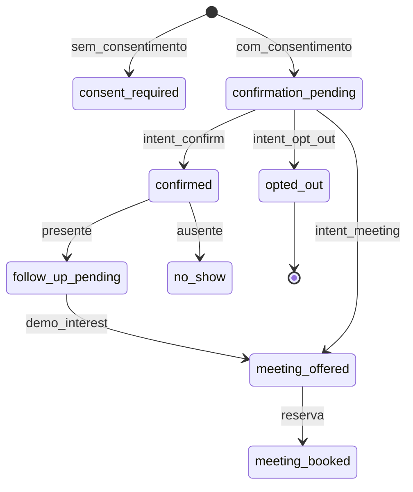
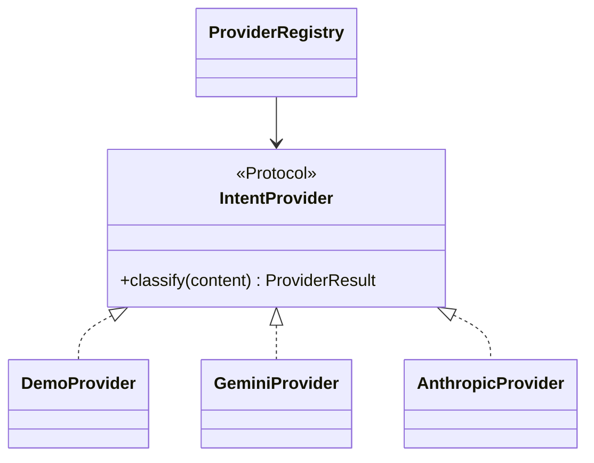
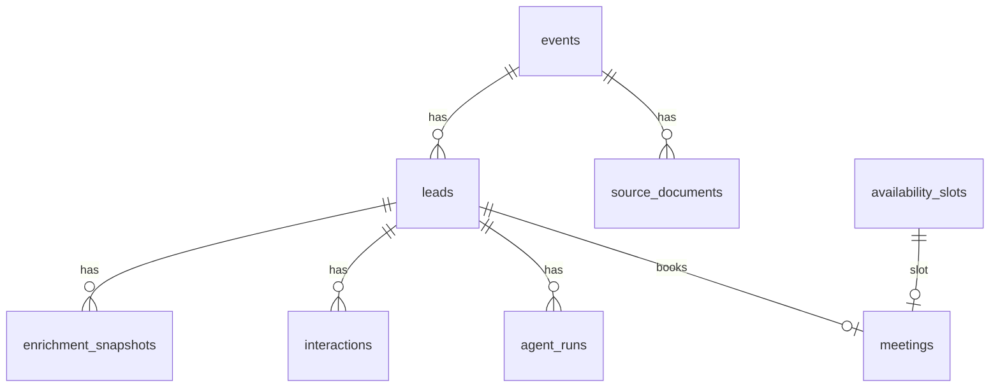

# Documentação Técnica — Vigil AI

Agente autônomo de funil comercial para o **Vigil Summit — Segurança para a Era da IA**, desenvolvido como case técnico Pareto/Vigil.AI.

## 1. Arquitetura da solução

### Visão geral



### Camadas

| Camada | Componente | Responsabilidade |
|--------|------------|------------------|
| Entrada | Landing + formulário | Captação de leads (Fase 1) |
| Entrada | Console `/ops` | Simulação de conversas e operação |
| Processamento | `workflow.py` | Orquestração do funil (state machine) |
| Processamento | `services.py` | Enriquecimento, scoring, playbooks |
| LLM | `providers/` | Classificação de intenção (Strategy) |
| Dados | PostgreSQL / SQLite | Persistência e auditoria |
| Canal | Simulador | Mensagens inbound/outbound no console |

### Fases do funil

| Fase | Trigger | Componentes |
|------|---------|-------------|
| **Captação** | `POST /leads` | Formulário → `on_registration` |
| **Enriquecimento** | Após consentimento | `enrich()` + `score()` + snapshot |
| **Engajamento pré-evento** | `registration`, `reply` | `compose()` + LLM classify |
| **Follow-up pós-evento** | `attendance`, `no_show` | `compose()` + agendamento |

### Fluxo de dados

1. Lead preenche formulário com consentimento explícito (`consent_email`).
2. Backend enriquece perfil, calcula score e envia mensagem de confirmação.
3. Operador simula reply do lead no console → LLM classifica intenção.
4. Playbook determinístico gera resposta e atualiza status.
5. Cada decisão é auditada em `agent_runs` e `interactions`.

---

## 2. Stack tecnológico justificado

### Agent framework: SDK nativo

O case aceita explicitamente **LangChain, CrewAI, Agno ou SDK nativo**. Escolhemos **SDK nativo** (`google-genai` + `anthropic`) porque:

- O agente é **híbrido**: playbooks determinísticos + 1 chamada LLM por reply
- Guardrails LGPD (consentimento, opt-out) precisam ser auditáveis antes de qualquer LLM
- Custo previsível: sem chains de raciocínio multi-step

### Orquestração: engine nativa (`workflow.py`)

Não usamos LangChain/CrewAI nem plataformas low-code (opcionais no case).

| Critério | Orquestração nativa | LangChain/CrewAI |
|----------|---------------------|------------------|
| Guardrails LGPD | Regras determinísticas antes do LLM | Risco de agente ignorar regras |
| Custo | LLM em 1 step | Risco de loops caros |
| Auditabilidade | `AgentRun` por trigger | Trace mais opaco |
| Complexidade | Adequado ao funil linear | Overhead para 4 fases |

**Evolução:** para 10 eventos simultâneos com multi-tool (WhatsApp, calendário, Apollo), **LangGraph** seria o próximo passo natural.

### State machine do funil



### Padrão Strategy para LLM



O funil e playbooks **não mudam** ao trocar LLM — só a classificação de intenção.

### Como trocar de LLM

```env
# Gemini (deploy padrão — tier gratuito AI Studio)
AGENT_MODE=gemini
GEMINI_API_KEY=...
GEMINI_MODEL=gemini-2.0-flash

# Anthropic / Claude (preferência do case)
AGENT_MODE=anthropic
ANTHROPIC_API_KEY=...
ANTHROPIC_MODEL=claude-3-5-haiku-latest

# Demo offline (CI, sem rede)
AGENT_MODE=demo
```

| Provider | Vantagem | Uso |
|----------|----------|-----|
| Gemini 2.0 Flash | Gratuito, JSON estruturado, baixa latência | Deploy Render |
| Claude 3.5 Haiku | Preferência do case, raciocínio estruturado | Produção com budget |
| Demo | Sem custo, determinístico | CI e fallback |

### Demais tecnologias

| Tecnologia | Justificativa |
|------------|---------------|
| FastAPI | API tipada, async-ready, OpenAPI automático |
| Next.js 15 | Landing + console com SSR e proxy Render |
| SQLAlchemy 2 | ORM maduro, suporte SQLite (dev) e PostgreSQL (prod) |
| PostgreSQL | Persistência relacional auditável em produção |
| Render | Deploy gratuito (web services + PostgreSQL); ver [`render.yaml`](render.yaml) e [`RENDER.md`](RENDER.md) |
| Docker + Compose | Stack local reproduzível (PostgreSQL 16 + backend + frontend); ver [`docker-compose.yml`](docker-compose.yml) |
| GitHub Actions | CI em push/PR: `pytest` no backend e `npm run build` no frontend; ver [`.github/workflows/ci.yml`](.github/workflows/ci.yml) |

### Containerização e CI

| Artefato | Função |
|----------|--------|
| [`backend/Dockerfile`](backend/Dockerfile) | Imagem Python 3.12-slim; `alembic upgrade head` + `uvicorn` na porta 8000 |
| [`frontend/Dockerfile`](frontend/Dockerfile) | Build multi-stage Node 20; `npm start` em produção na porta 3000 |
| [`docker-compose.yml`](docker-compose.yml) | Orquestra `db`, `backend` e `frontend` com healthcheck no Postgres e `AGENT_MODE=demo` |
| [`.github/workflows/ci.yml`](.github/workflows/ci.yml) | Pipeline paralelo: backend (Python 3.12 + pytest) e frontend (Node 20 + build) |

---

## 3. Banco de dados e modelo de dados

### Diagrama ER



### Tabelas principais

| Tabela | Propósito |
|--------|-----------|
| `events` | Evento Vigil Summit (data, local, capacidade) |
| `leads` | Participantes com scores, status e consentimento |
| `enrichment_snapshots` | Perfil enriquecido por lead |
| `interactions` | Mensagens inbound/outbound (canal simulado) |
| `agent_runs` | Auditoria de cada decisão do agente |
| `availability_slots` | Horários para reuniões comerciais |
| `meetings` | Reuniões agendadas |
| `source_documents` | Documentos do evento (Q&A com busca por termos) |

### Q&A do evento (`POST /event/answer`)

Respostas baseadas exclusivamente em `source_documents` — sem LLM generativo:

1. Tokeniza a pergunta (termos com mais de 2 caracteres).
2. Ranqueia documentos por contagem de termos presentes em `title` + `excerpt`.
3. Retorna o excerpt do melhor match e até **3 citações** com título, URL e trecho.
4. Se nenhum documento tiver match → `requires_human_review: true` e encaminhamento para revisão humana.

### Validação

- API docs: `/docs`
- Dashboard: `GET /dashboard` (autenticado)
- Console: `/ops` com credenciais de operador
- **CI:** GitHub Actions executa `pytest` (backend) e `npm run build` (frontend) em cada push/PR
- **Evals de intenção:** `python backend/evals/run.py` mede acurácia do `DemoProvider` contra [`backend/evals/intents.pt-BR.jsonl`](backend/evals/intents.pt-BR.jsonl) (5 casos pt-BR)

---

## 4. Réguas de comunicação

### Pré-evento

| Trigger | Condição | Ação | Timing |
|---------|----------|------|--------|
| `registration` | `consent_email=true` | `send_confirmation` | Imediato após cadastro |
| `registration` | `consent_email=false` | `stop_communication` | Imediato |
| `reply` | intent=confirm, confidence≥0.65 | `send_agenda` | Sob demanda |
| `reply` | intent=opt_out | `stop_communication` | Imediato, irreversível |
| `reply` | intent=meeting_interest | `show_slots` | Sob demanda |

**Exemplo personalizado (pré-evento):**

> Olá, Marina. No Vigil Summit vamos discutir **LGPD e risco de terceiros** com foco em decisões executivas. Posso confirmar sua presença?

Dados usados: `name`, `security_signal` (enriquecimento por setor financeiro).

### Pós-evento

| Trigger | Condição | Ação |
|---------|----------|------|
| `attendance` + demo | Presente com interesse | `offer_meeting` |
| `attendance` | Presente sem demo | `send_recap` |
| `no_show` | Ausente | `send_no_show_recap` |

**Exemplo personalizado (pós-evento):**

> Obrigado por participar, Marina. Posso sugerir horários para uma conversa de 30 minutos?

Dados usados: `name`, `demo_interest`, histórico de interações.

### Regras de negócio

- Confidence mínima para LLM: **0.65**
- Abaixo disso → `human_review`
- Opt-out bloqueia qualquer ação futura
- Limite de chamadas LLM: **20 por provider** (`AGENT_CALL_LIMIT`)

---

## 5. Estratégia de dados e personalização

### Coleta

- Formulário na landing: nome, e-mail, empresa, cargo, desafio, consentimento
- E-mail corporativo validado; telefone opcional

### Enriquecimento

- **Fonte:** catálogo determinístico (`enrich()` em `services.py`)
- Deriva setor, sinal de segurança, senioridade e domínio a partir de empresa/cargo
- Sem scraping aberto ou APIs comerciais (Apollo citado como provider futuro substituível)
- Snapshot persistido em `enrichment_snapshots`

### Personalização

- Mensagens usam `security_signal`, `challenge`, `name` do perfil enriquecido
- Score prioriza CISO/CTO, empresas 200+ e menções a LGPD/compliance

### LGPD

| Controle | Implementação |
|----------|---------------|
| Consentimento | `consent_email` obrigatório para processamento |
| Opt-out | Intent detectada → `status=opted_out`, bloqueio total |
| Minimização | Viewer recebe PII mascarada |
| Exclusão | `DELETE /leads/{id}` anonimiza PII e registra auditoria |
| Limite LLM | 20 chamadas por provider para controlar custo e exposição |

---

## 6. Decisões estratégicas

### Três decisões principais

1. **Strategy pattern para LLM** — honra preferência Anthropic do case sem lock-in; Gemini no deploy por custo zero
2. **Canal simulado no console** — justificado para público B2B executivo: e-mail seria lento para demo; WhatsApp exige integração e compliance adicional
3. **Arquitetura híbrida (playbooks + LLM)** — regras determinísticas autorizam estados; LLM só classifica intenção

### Alternativas descartadas

| Alternativa | Motivo |
|-------------|--------|
| LangChain/CrewAI | Overhead para funil linear; guardrails menos auditáveis |
| Agente 100% LLM | Risco de ignorar opt-out; custo imprevisível |
| Só Anthropic no deploy | Custo pago; Gemini gratuito para avaliação |
| WhatsApp real | Complexidade de integração e LGPD para case com prazo |

### Referências

- Preferência Anthropic do case (agency, tool use, structured reasoning)
- Padrão Strategy (Gang of Four) para providers plugáveis
- Abordagem híbrida inspirada em sistemas de produção que separam policy engine de NLU

---

## 7. Plano de execução (primeiros 5 dias)

| Dia | Foco | Entregas |
|-----|------|----------|
| 1 | Infra + captura | Render, PostgreSQL, landing, `POST /leads` |
| 2 | Enriquecimento + playbooks | `enrich`, `score`, mensagens pré-evento |
| 3 | LLM Strategy | Providers Gemini/Anthropic, classificação de reply |
| 4 | Pós-evento + agendamento | Attendance, slots, meetings |
| 5 | Documentação + polish | Console, testes E2E, docs, credenciais avaliadores |

**Primeiro a provisionar:** banco + API + consentimento — sem dados persistidos e auditáveis, nenhuma fase posterior é demonstrável.

---

## 8. Cenário de escala (bônus)

**Cenário:** 10 eventos regionais simultâneos (manufatura, saúde, finanças, governo).

**Adaptações sem reescrever o agente:**

1. `event_id` já existe — parametrizar playbooks por vertical em `compose(trigger, event_config)`
2. `workflow.py` recebe config por evento (réguas, timings, templates)
3. Filas por evento (Redis/SQS) para processamento assíncrono de replies
4. LangGraph para orquestração multi-tool quando integrar WhatsApp + calendário + Apollo
5. Strategy de LLM permanece — troca de modelo por evento via env ou config

---

## 9. Acesso para teste

### URLs

- **Produção:** configurar conforme [`RENDER.md`](RENDER.md)
- **Local (dev):** `http://localhost:3000` (landing), `http://localhost:3000/ops` (console)
- **Local (Docker):** `docker compose up --build` — sobe PostgreSQL, backend (`:8000`) e frontend (`:3000`) com credenciais demo e `AGENT_MODE=demo`

### Credenciais demo

| Papel | Usuário | Senha (padrão) |
|-------|---------|----------------|
| Operador | `operator` | `vigil-demo` |
| Viewer | `viewer` | `viewer-demo` |

### Roteiro E2E (5 passos)

1. Cadastre um CISO/CTO com e-mail corporativo e consentimento.
2. Entre no console `/ops` e abra o dossiê.
3. Simule reply: `Confirmo minha presença`.
4. Marque `Presente + demo` e reserve um horário.
5. Cadastre outro lead e simule `Por favor, remova meu contato` (opt-out).

### Contato

Para acesso temporário: **ramon@pareto.io**

---

## Estrutura do código

```
backend/app/
├── providers/          # Strategy LLM (demo, gemini, anthropic)
├── workflow.py         # Orquestrador nativo do funil
├── services.py         # Enriquecimento, scoring, playbooks
├── main.py             # Rotas FastAPI (incl. Q&A ranqueado por termos)
└── models.py           # ORM

backend/evals/
├── intents.pt-BR.jsonl # Casos de avaliação de classificação de intenção
└── run.py              # Script de acurácia contra DemoProvider

backend/tests/          # Testes pytest (workflow, providers)
backend/Dockerfile      # Imagem de produção do backend

frontend/
├── app/page.tsx        # Landing
├── app/ops/            # Console operacional
└── lib/api.ts          # Cliente API (proxy /backend em prod)
frontend/Dockerfile     # Imagem de produção do frontend

docker-compose.yml      # Stack local (db + backend + frontend)
.github/workflows/ci.yml # Pipeline CI (pytest + build)
render.yaml             # Blueprint Render (PostgreSQL + backend + frontend)
```
